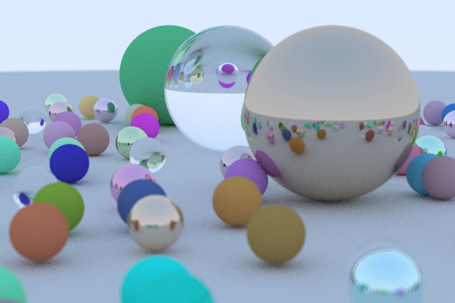

# raytracer

This is [Ray Tracing in One Weekend](https://raytracing.github.io/books/RayTracingInOneWeekend.html) implemented in Rust.

## TODO

- [x] Output an image
- [x] Vector utilities
- [x] Basic skybox rendering
- [x] Rendering a sphere in normal vectors
- [x] Rendering multiple spheres
- [x] Multi-sampling
- [x] Diffuse materials
- [x] Gamma correction filter
- [x] Reflective materials
- [x] Reflective materials with fuzziness
- [x] Dielectric materials
- [x] Positionable camera
- [x] Depth of field
- [ ] Scene configuration
- [ ] Material configuration
- [ ] Multi-threaded rendering

## Running the program

### Prerequisites

There shouldn't be any limitation on the operating system you use as long as you have **Rust toolchain** installed on it. For those who doesn't have any experience in Rust, google for `rustup`.

### Running

In the project directory, use `cargo run --release` to build the project. `release` is recommended here because it activates all compile-time optimizations, and ray traces are computationally-intensive programs.


```bash
$ cargo run --release
    Finished release [optimized] target(s) in 1.23s
     Running `target\release\ray_tracer.exe`
███████████████████████████████████████████████████████████████150/150
Finished, time = 87546ms.
Writing to out.png...
```

Main binary produces a picture of lots of random spheres like the one in the book.
Typically it takes 1~3 minutes to produce the result(~1min 30s on my Core-i5 machine). Here is an example:

