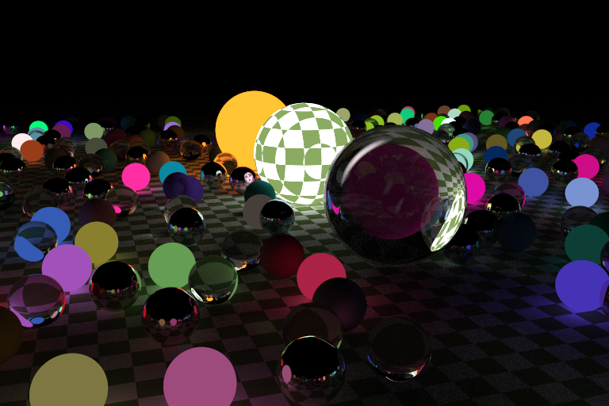
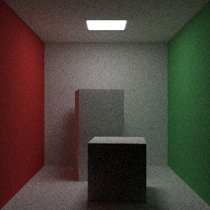

# rustyray

This is [Ray Tracing in One Weekend](https://raytracing.github.io/books/RayTracingInOneWeekend.html) implemented in Rust.

## TODO

### one weekend
- [x] Output an image
- [x] Vector utilities
- [x] Basic skybox rendering
- [x] Rendering a sphere in normal vectors
- [x] Rendering multiple spheres
- [x] Multi-sampling
- [x] Diffuse materials
- [x] Gamma correction filter
- [x] Reflective materials
- [x] Reflective materials with fuzziness
- [x] Dielectric materials
- [x] Positionable camera
- [x] Depth of field

### next week

- [x] Motion blur
- [x] Bounding volume hierarchies
- [x] Various perlin noise texture
- [x] Image texture
- [x] Light sources
- [x] Rectangles
- [x] Fog objects
- [x] Volume
- [ ] Instance translation
- [x] Instance rotation
- [x] Cornell box scene
- [x] Final scene

## "One more thing"s

- [x] Scene configuration
- [ ] Material configuration
- [x] Quality presets
- [x] Multi-threaded rendering
- [ ] SIMD support
- [ ] WASM support

## Running the program

### Prerequisites

There shouldn't be any limitation on the operating system you use as long as you have **Rust toolchain** installed on it. For those who doesn't have any experience in Rust, google for `rustup`.

### Running

In the project directory, use `cargo run --release` to build the project. `release` is recommended here because it activates all compile-time optimizations, and ray traces are computationally-intensive programs.


```bash
$ cargo run --release -- -c RandomSpheresNightScene -p 2
    Finished release [optimized] target(s) in 0.62s
    Running `target\release\ray_tracer.exe -c RandomSpheresNightScene -p 2`
Start rendering scene RandomSpheresNightScene...
Configuration: Picture size = 768 * 512, sample = 1024, recursion depth = 16
Initializing threads... Thread count = 4
Thread 0 initiated
Thread 1 initiated
Thread 2 initiated
Thread 3 initiated
Thread 1 exit.
Thread 0 exit.
Thread 3 exit.
Thread 2 exit.
Done, time elapsed = 271.4306073s
Writing to out.png...

```

Which gives you this beautiful image(colors & materials are randomized):


Or the cornell box scene(render this with `-c CornellBoxScene`):


